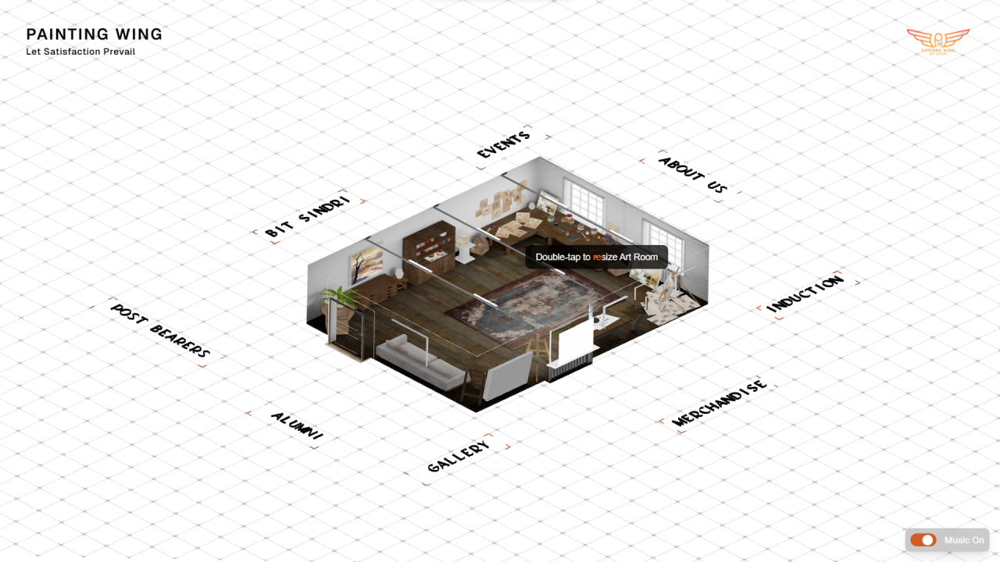
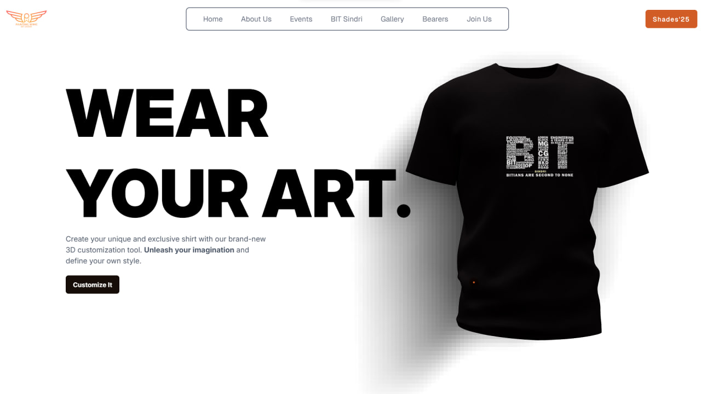

# Painting Wing Web Application
---

## 🎨 Overview

This is a modern, interactive web application for the Painting Wing of BIT Sindri. It showcases the club’s artwork, events, members, and enables new member inductions. The project blends 3D graphics, beautiful UI, and full-stack integrations for a seamless experience.

---

## 🚀 Features

- **3D Interactive Landing Page**: Built with React Three Fiber, featuring a 3D art studio scene and animated navigation.
- **Gallery & Art Exhibition**: Dynamic, responsive gallery pages for wall paintings, exhibitions, and student creations.
- **Induction Form**: Animated, validated form for new member applications. Data is sent to Google Sheets for easy management.
- **Custom 404 Page**: Branded, animated error page for a consistent user experience.
- **Background Music**: Toggleable ambient music with persistent state.
- **Mobile Responsive**: All components adapt to any device.
- **Cloudinary Integration**: Artwork uploads are stored securely in the cloud.
- **MongoDB Integration**: Induction data and artwork URLs are stored in a database.

---

## 🛠️ Tech Stack

- **Frontend**: React, Next.js (App Router), Tailwind CSS, Framer Motion
- **3D Graphics**: React Three Fiber, Drei, GLTF models
- **Forms**: React Hook Form, react-hot-toast
- **Backend/API**: Next.js API routes
- **Database**: MongoDB Atlas
- **Cloud Storage**: Cloudinary
- **Google Sheets**: Google Apps Script Web App

---

## 📸 Screenshots & Videos


- **Landing Page**
  
- **Merchandise**
  
- **Induction Form**
  


---

## 🏁 Getting Started

### 1. Clone the repository

```bash
git clone https://github.com/Askulo/painting-wing.git
cd painting-wing
```

### 2. Install dependencies

```bash
npm install
```

### 3. Set up environment variables

Create a `.env.local` file:

```env
MONGODB_URI=your_mongodb_uri
MONGODB_DB=your_db_name
CLOUDINARY_CLOUD_NAME=your_cloud_name
CLOUDINARY_API_KEY=your_api_key
CLOUDINARY_API_SECRET=your_api_secret
```

### 4. Run the development server

```bash
npm run dev
```

### 5. Deploy

- Recommended: Vercel, Netlify, or any Node.js hosting platform.
- Set all environment variables in your deployment dashboard.

---

## 📝 Induction Form & Google Sheets Integration

- Induction form submissions are sent to a Google Sheet via a Google Apps Script Web App.
- [Sample Apps Script](docs/google-apps-script.md) included for easy setup.

---

## 🧩 Project Structure

```
public/
  screenshots/
  videos/
  ...
src/
  app/
    Components/
    context/
    hooks/
    lib/
    ...
```

---

## 💡 Customization

- **3D Models**: Replace `/public/art_studio.glb` with your own GLTF models.
- **Gallery Images**: Add images to `/public/wall-painting/`, `/public/Art-Exhibition/`, `/public/creationsg/`.
- **Branding**: Update colors, logos, and gradients in Tailwind config and components.

---

## 🐞 Troubleshooting

- **500 Errors**: Check environment variables and deployment logs.
- **CORS Issues**: Ensure Google Apps Script is deployed as a Web App with public access.
- **File Uploads**: Cloudinary credentials must be set in both local and production environments.

---

## 📚 Documentation

- [Google Apps Script Setup](docs/google-apps-script.md)
- [Cloudinary Integration](docs/cloudinary.md)
- [MongoDB Setup](docs/mongodb.md)

---

## 👥 Contributors

- [Your Name](https://github.com/mandal027)
- [Askulo](https://github.com/Askulo)

---

## 📄 License

This project is licensed under the MIT License.

---

## 🌐 Live Demo

> https://www.paintingwing.com/

---

## 🙏 Acknowledgements

- BIT Sindri Painting Wing
- Nextjs
- React Three Fiber & Drei
- Threejs
- Framer-motion
- Blender
- Gsap
- Tailwind-CSS
- Google-ModelViewer
- Cloudinary
- MongoDB Atlas
- Google Apps Script


---


